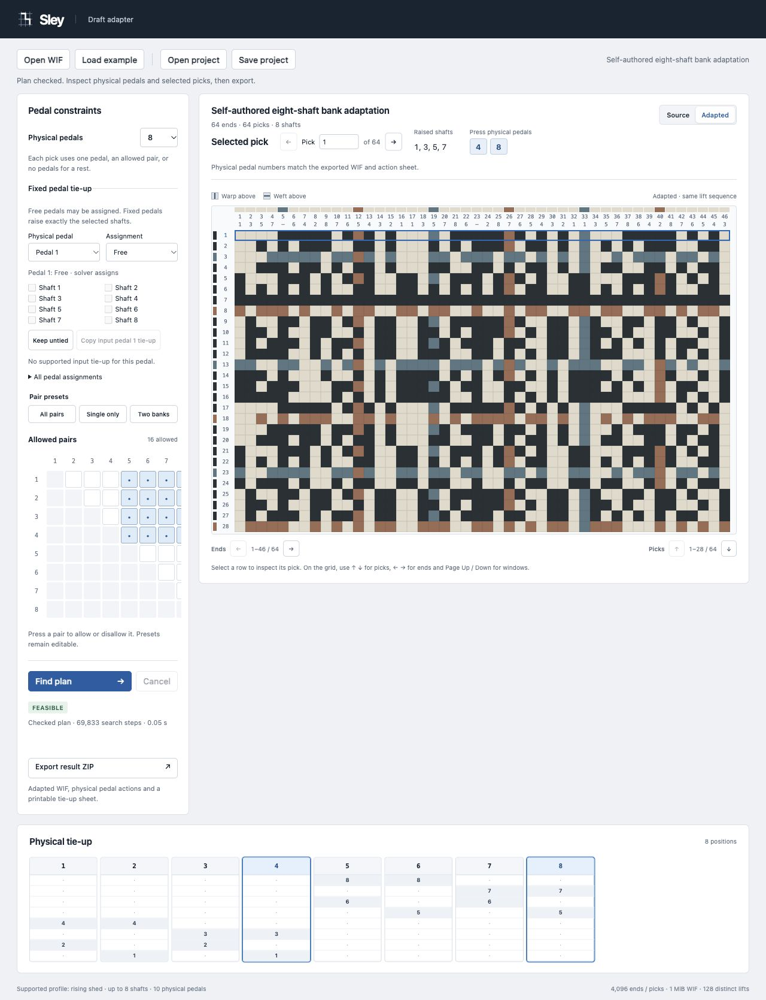

# Sley


Adapt a weaving draft to your physical pedals and allowed pairs.

Open a supported WIF (Weaving Information File), choose which pedals may be pressed together, and inspect the resulting tie-up and pressing sequence. Sley preserves the draft's threading, lifts, colors and independent metadata.

[Run locally](#run-locally) · [Supported WIF profile](docs/wif.md)



## Run locally

Python 3.12 or newer. Sley uses the Python standard library and a local browser; it makes no remote calls.

From a source checkout:

```sh
python -m sley
```

Or install the release wheel, then launch:

```sh
python -m pip install ./sley-0.2.2-py3-none-any.whl
sley
```

The launcher opens a loopback URL. Use `sley --no-browser` to print it, or `sley --port 4476` to choose a local port. Ctrl+C stops the server and any calculation process.

## Use a draft

1. Open a WIF or use the bundled eight-shaft example.
2. Set the physical pedal count and edit allowed pairs. All-pairs, single-pedal and two-bank presets are editable constraints.
3. Keep selected pedals fixed to exact shaft sets, or choose **Keep untied**. Leave spare pedals **Free** for the solver. **Copy input pedal tie-up** copies only the selected source pedal; it does not assume the input describes your current hardware.
4. Find a plan. Inspect its drawdown, physical tie-up and selected pick. Cancel a running search if needed.
5. Export the current Feasible result. The ZIP contains `adapted.wif`, `actions.csv` and printable `tie-up.html`.

WIF treadle numbers equal physical pedal positions, including unused gaps and unused fixed pedals. Every output pick retains its original index. Save/Open project stores the original WIF and constraints in a versioned JSON document; calculated results are not saved. Version 2 records each pedal as `null` (free), `[]` (fixed untied), or an exact shaft list. Version 1 projects reopen with all pedals free. A fresh WIF import resets fixed assignments; reducing the pedal count refuses to remove any fixed pedal. Editing inputs invalidates results and export. Invalid imports retain the current draft.

Try [the fixed-pedal project](sley/examples/fixed-pedals.sley.json) with **Open project**. Pedal 1 stays tied to shaft 1, pedal 3 stays untied, and the solver assigns pedal 2 to shaft 2. The four picks use pedal 1, pedal 2, the allowed pair 1+2, then no press. This self-authored example is also included in the wheel's `sley/examples` directory.

## Results and limits

- **Feasible:** a checked plan raises exactly the requested shafts using one pedal or one permitted pair per pick. A rest presses none.
- **Infeasible:** the finite search exhausted all relevant assignments for these fixed physical slots.
- **Unknown:** the work or time budget ended without a conclusion. No partial actions can export.

Supported input: explicit rising-shed WIF 1.1, at most eight shafts, ten physical pedals, 4,096 ends, 4,096 picks, 128 distinct lift sets and 1 MiB source text. Import reserves room for rewritten controls within the same 1 MiB export limit; excessive retained text is refused before search. Sparse zero/unthreaded positions are preserved. Multiple-shaft threading, ambiguous competing control paths, sinking/missing shed direction, unknown private control semantics and values beyond bounds are refused rather than guessed or trimmed. This is a declared interchange profile, not full WIF compliance.

The search solves distinct lifts together and expands every original pick afterward. Defaults are 500,000 work units and five seconds, with a separate 15-second child-process deadline and cancellation. Allowed pairs are user-defined constraints; the app does not model loom mechanics. [WIF preservation and model details](docs/wif.md).

## Verify

```sh
python -m unittest discover -s tests -v
node --test sley/static/model.test.mjs
```

Tests exercise original-index expansion, 4,096×4,096 drafts, a changed final pick, sparse late ends, bounded raw project JSON, physical gaps, refusal paths, worker cleanup and actual local HTTP export. The original finite solver was checked against independent exhaustive small-case enumeration. Existing [dtx_to_wif 4.7.1](https://github.com/r-owen/dtx_to_wif) readbacks matched the larger adapted draft's lifts, threading, colors, notes and physical actions. This reader is used for development verification only.

Sley uses intersection-based set-basis search, an established approach also described by [Tim's Treadle Reducer](https://www.cs.earlham.edu/~timm/treadle/). This implementation adds declared pair constraints and exact fixed assignments on physical slots. MIT license.
